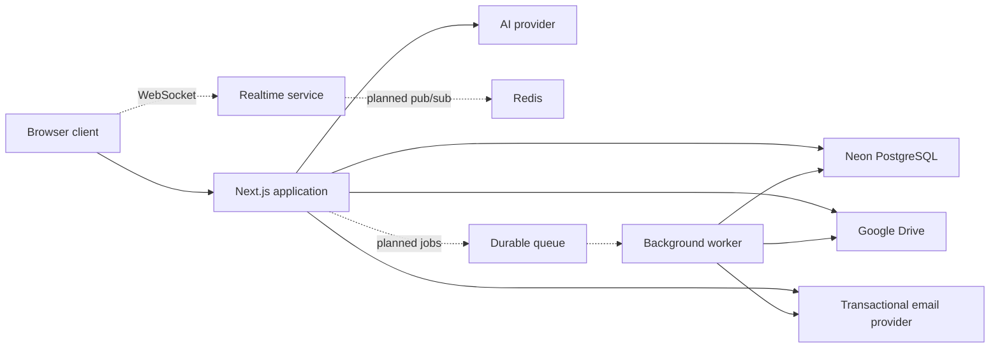
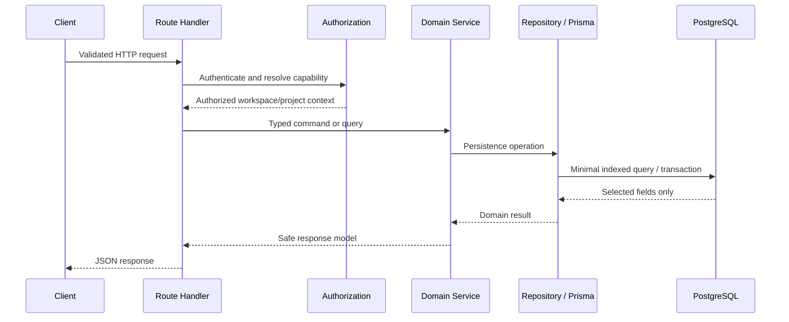

# Flowdek Architecture

## Purpose

This document defines Flowdek's current architecture, intended production
architecture, module boundaries, data ownership, and scaling rules. It is the
reference for deciding where new functionality belongs.

Flowdek is a multi-tenant project-management application. Its primary workload is
relational: users belong to workspaces, workspaces contain projects, and projects
contain tasks, members, comments, files, approvals, budgets, timesheets, goals,
forms, automations, and activity records.

## Architecture decision summary

| Concern | Decision | Status |
| --- | --- | --- |
| Application shape | Modular monolith with separately deployed workers and realtime service | Accepted |
| Web application | Next.js App Router | Implemented |
| HTTP API | Thin Next.js Route Handlers acting as a backend-for-frontend | Implemented |
| Business logic | Server-only domain services under `src/server` | Implemented, evolving |
| Primary database | Managed PostgreSQL hosted by Neon | Accepted |
| Database access | Prisma ORM with repositories for shared queries | Implemented |
| Runtime connection | Neon pooled connection | Pending environment setup |
| Migration connection | Neon direct connection | Pending Prisma configuration |
| File contents | Each user's Google Drive | Implemented, pending credentials |
| File metadata | PostgreSQL | Implemented |
| Transactional email | Gmail SMTP (temporary; Resend planned) | Implemented, pending credentials |
| Realtime collaboration | Separate authenticated Socket.IO service | Prototype |
| Background work | Separate durable worker and queue | Planned |
| Cache, queue, presence | Redis-compatible service | Planned |

## System context



Solid lines represent implemented or directly supported paths. Dashed lines are
planned production boundaries.

## Deployment units

### Next.js application

The Next.js process owns pages, layouts, authentication entry points, short-lived
HTTP requests, CRUD orchestration, validated domain-service access, and storage
OAuth callbacks.

It must not permanently own WebSocket connections, long-running jobs, retry loops,
scheduled automation, bulk imports, or expensive report generation. Those
workloads have different failure and scaling characteristics.

### PostgreSQL

PostgreSQL is the source of truth for product and authorization data. Neon is the
selected managed PostgreSQL provider for the current stage.

PostgreSQL stores:

- Users, verification state, and account status.
- Workspaces, memberships, invitations, projects, and project memberships.
- Tasks, sections, dependencies, followers, tags, and custom fields.
- Comments, mentions, reactions, activities, and notifications.
- Goals, approvals, forms, timesheets, budgets, and expenses.
- Automation definitions and recurrence state.
- File metadata and encrypted storage-provider credentials.
- Audit records required to explain important changes.

PostgreSQL does not store uploaded file bytes. A `File` record points to the
provider object owned by the user's connected storage account.

### User-connected storage

Every user connects Google Drive. Flowdek stores encrypted OAuth credentials and
provider object identifiers in PostgreSQL, while file contents remain in the
user's cloud account. The active integration uses Google's narrow drive.file
scope, so Flowdek can access files it creates without requesting broad Drive
access. OneDrive and Dropbox remain deferred behind the provider boundary.

A provider failure must fail only the affected file operation. It must not make
projects, tasks, or authentication unavailable.

Legacy R2 support is read-only compatibility for old records.
`ENABLE_LEGACY_R2_UPLOADS` remains disabled and new files must never use R2.

### Transactional email

The email domain uses Gmail SMTP with a Google app password for the current
development stage. Authentication, invitation, and workspace code call the
provider-neutral sendEmail service; replacing Gmail with Resend later is
therefore isolated to the transport boundary. Production fails closed when SMTP
credentials are missing, and development logs metadata without token-bearing
message bodies.

### Realtime service

`services/realtime` is currently an isolated Socket.IO prototype. Before production
integration it must gain:

- Cryptographically verified user authentication.
- Workspace and project authorization on every room join.
- Server-authoritative mutations; clients must not broadcast unverified changes.
- Redis-backed pub/sub and presence for multi-instance deployment.
- Origin restrictions, rate limits, structured logs, and health checks.
- Reconnection, resynchronization, and stale-event handling.

PostgreSQL remains authoritative. Realtime events notify clients about committed
changes; they do not replace database transactions.

### Background worker

A separately deployed worker will eventually own recurring task generation, email
delivery, notification fan-out, automation execution, OAuth token refresh,
retryable storage operations, large imports/exports, reports, and cleanup jobs.

Jobs must be idempotent and carry a stable idempotency key. A retry must not create
duplicate tasks, notifications, charges, or files.

## Code boundaries

- `src/app` contains pages, layouts, and UI composition.
- `src/app/api` translates HTTP requests and responses. Route handlers stay thin.
- `src/features` owns product UI, feature state, hooks, and client-facing types.
- `src/shared` contains code shared safely across product features.
- `src/server` contains server-only schemas, authorization, repositories, domain
  services, database access, email, AI, and storage integrations.
- `prisma/schema.prisma` is the source of truth for persisted entities.
- `prisma/migrations` is the ordered database change history.
- `services/realtime` is an independently deployable realtime boundary.

Client components must never import `src/server` modules or receive secrets,
encrypted tokens, password hashes, or unrestricted database records.

## Request and data flow



Server Components should call repositories or domain services directly. They
should not call the application's own Route Handlers through HTTP, which adds a
network round trip and duplicates authorization and serialization work.

## Neon PostgreSQL decision

### Why Neon is appropriate now

Neon is standard PostgreSQL, works with the existing Prisma schema and migrations,
and provides pooled connections, autoscaling, branching, restore history, and read
replicas. It is suitable for development, staging, initial production, and
meaningful growth.

The data model is not locked to a proprietary API. Migration to another PostgreSQL
host remains possible with standard PostgreSQL tools if requirements later change.

### Required connection model

Use two connection strings:

```env
# Pooled URL used by the running Next.js application and workers.
DATABASE_URL="postgresql://...-pooler.../flowdek?sslmode=require"

# Direct URL used by Prisma migrations, database administration, and pg_dump.
DIRECT_URL="postgresql://.../flowdek?sslmode=require"
```

The runtime uses the pooled endpoint to prevent auto-scaling application instances
from exhausting PostgreSQL connections. Migrations and administration use the
direct endpoint because transaction pooling changes session behavior. Neon
documents both modes in its
[connection-pooling guide](https://neon.com/docs/connect/connection-pooling).

The Prisma datasource declares `directUrl = env("DIRECT_URL")`, keeping migration
traffic off the pooled runtime connection.

### Environment layout

Use isolated Neon branches or databases for:

- `development`: developer testing and local migrations.
- `staging`: production-like verification with non-production data.
- `production`: customer data, protected from deletion and development access.

Production migrations run through CI/CD with `prisma migrate deploy`. Developers
must never run `prisma migrate dev` against production.

### Production settings

- Use the free plan for development only.
- Move production to a paid plan before onboarding real customers.
- Disable scale-to-zero if consistent first-request latency matters.
- Keep scale-to-zero for development and preview branches to control cost.
- Configure and test the restore window.
- Protect the production branch.
- Put Neon and the application in nearby regions.
- Monitor connections, slow queries, CPU, memory, and storage.
- Reconnect after transient database interruptions.

Paid plans can disable scale-to-zero; free-plan computes resume after inactivity
and add cold-start latency. See Neon's
[scale-to-zero guide](https://neon.com/docs/introduction/scale-to-zero) and
[compute guide](https://neon.com/docs/manage/endpoints/).

Neon's published availability SLA applies to Business and Scale plans, not the free
plan or every platform component. Reliability also requires retries, monitoring,
and tested recovery. See the [Neon SLA](https://neon.com/sla).

## Query and performance rules

Every domain implementation must:

1. Select only fields required by the caller.
2. Paginate tasks, comments, activities, audit logs, notifications, and search.
3. Avoid N+1 queries; batch related reads or deliberately select relations.
4. Add indexes from measured query patterns, not speculation.
5. Use a transaction for changes that must succeed or fail together.
6. Keep transactions short and never call an external API inside one.
7. Set timeouts for external calls and expensive operations.
8. Measure query count and latency for high-traffic endpoints.
9. Cache only data that may safely be stale and define invalidation rules.
10. Move retryable or long-running work out of request handlers.

Partitioning and read replicas are not initial requirements. Consider them only
after measurement shows that audit/activity data or reporting needs independent
scaling.

## Reliability and recovery

Initial objectives:

- Availability target: 99.9% after production launch.
- Recovery point objective: no more than five minutes of data loss.
- Recovery time objective: restore core access within thirty minutes.

Required practices:

- Database restore history plus periodic independent logical exports.
- Quarterly restore drills into an isolated branch or project.
- Health checks for web, database, worker, queue, realtime, email, and storage.
- Centralized errors and structured logs with correlation IDs.
- Idempotency for jobs, webhooks, OAuth callbacks, and retried mutations.
- Graceful degradation when AI, email, or storage is unavailable.
- A rollback or forward-fix plan for every production migration.

## Security boundaries

- Enforce server-side authorization on every protected read and mutation.
- Scope workspace and project queries by authorized membership.
- Encrypt storage OAuth credentials with a dedicated 32-byte key.
- Keep secrets in environment or secret-management systems, never Git.
- Validate request bodies, file sizes, content types, and external responses.
- Rate-limit authentication, invitations, AI, storage, and public forms.
- Audit sensitive changes without recording secret values.

## Adding an endpoint

1. Define validation beside the relevant `src/server` domain.
2. Resolve authentication and authorization before accessing domain data.
3. Put business rules in a service, not the Route Handler.
4. Put reusable Prisma queries in a repository and select required fields only.
5. Use a transaction when an invariant spans multiple records.
6. Expose the service through a route under `src/app/api`.
7. Map errors to stable, non-sensitive HTTP responses.
8. Add service, validation, and authorization tests.
9. Verify query count, pagination, and indexes.

## Scaling triggers

Do not split the modular monolith in anticipation of growth. Extract a service only
when measurements or team ownership demonstrate a real boundary.

| Trigger | Response |
| --- | --- |
| Request timeouts from retryable work | Move work to the queue and worker |
| Multiple realtime instances | Add Redis pub/sub and shared presence |
| Reporting affects transaction latency | Add a read replica or reporting pipeline |
| Search outgrows PostgreSQL | Introduce a dedicated search index |
| A domain needs independent deployments | Extract it behind a versioned API |
| Audit/activity tables dominate storage | Evaluate retention and partitioning |

## Deferred decisions

Wait for production measurements before adding a separate public API service,
domain microservices, cross-region active-active operation, a search cluster, an
analytics database, Kubernetes, or table partitioning.

## Project Documents and template library

Project Documents is a provider-native document domain. `DocumentTemplate` stores versioned, structured template definitions; `ProjectDocument` stores only project metadata and the provider file reference. File bodies never pass through or remain in Flowdek storage.

Creation follows this boundary:

1. The route verifies the project capability and validates input.
2. The service loads the project, template, and caller's Google connection in one parallel read group.
3. The allow-listed resolver substitutes project and workspace variables without evaluating code.
4. The Google adapter creates and populates a native Doc or Sheet.
5. Only after provider success does Flowdek persist the reference and audit the action.

A provider failure therefore leaves no orphaned database reference. Removing a Project Document deletes only the Flowdek reference; it intentionally does not delete the user's Google Drive file. Disconnecting a storage account is blocked while either uploaded files or project-document references depend on it.

The adapter interface isolates provider APIs so OneDrive and Dropbox document implementations can be added without changing routes, template data, or the user interface. Template seeding uses stable slugs and transactional upserts, making repeated deployment seeds safe.
