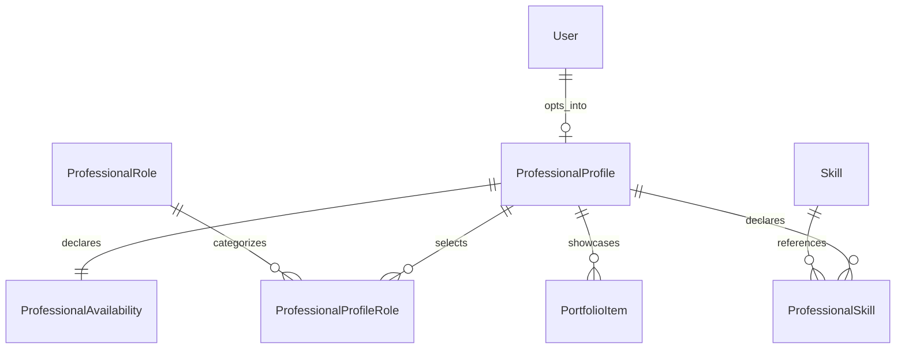

# Flowdek Talent Network: Phase 0 Architecture Map

## Decision summary

The Talent Network belongs in the existing Next.js modular monolith as a
user-scoped domain. Phase 1 adds professional profiles and a shared competency
taxonomy only. It does not alter workspace membership, project membership, task
assignment, file access, or payment behavior.

This boundary is deliberate: a professional profile answers **what a user offers**;
`WorkspaceMember` and `ProjectMember` continue to answer **what that user may
access**. Later engagement and task-access phases must connect those concepts with
new explicit records rather than overloading either one.

## Existing architecture to reuse

| Concern | Existing source | Phase 1 use |
| --- | --- | --- |
| Account identity | `prisma/schema.prisma` → `User` | One optional profile per user; no registration hook |
| Authentication | `src/server/auth/authorization.ts` | `requireAuthenticatedUser()` on every Talent API |
| Authorization | `src/server/auth/capabilities.ts` | Remains unchanged; profile ownership is checked by authenticated `userId` |
| Database client | `src/server/db/client.ts` | Shared Prisma singleton and minimal `select` projections |
| Validation | Zod schemas under `src/server/*/schemas.ts` | Talent-specific draft, publish, and URL validation |
| HTTP errors | `src/server/http/errors.ts`, `src/server/http/responses.ts` | `ServiceError`, `validationError`, and `apiError` |
| Audit trail | `src/server/audit/log.ts` | Create, update, publish, unpublish, and portfolio mutations |
| Product routing | `src/shared/navigation/routes.ts` | Canonical profile and edit routes |
| Product shell | `src/app/(product)/layout.tsx` | Existing authenticated, scrollable desktop/mobile shell |
| Navigation | `src/features/flowdeck/components/layout/navItems.ts` | Talent entry in desktop and mobile More navigation |
| Notifications | `src/server/notifications/notification.service.ts` | No Phase 1 self-notifications; reuse in later invitations/engagements |
| Tests | Node test runner via `tsx --test` | Pure validation/service tests plus route-helper coverage |
| Seeds | transactional upsert pattern in document template seeding | Idempotent role and skill taxonomy seed |

## Data ownership and relationships



### Reused models

- `User`: authentication and account lifecycle source of truth.
- `AuditLog`: immutable record of material profile mutations.
- `WorkspaceMember`, `ProjectMember`, and `Task`: unchanged in Phase 1 and only
  related conceptually for future phases.

### New Phase 1 models

- `ProfessionalProfile`: one-to-one user-owned professional identity.
- `ProfessionalRole`: globally shared role taxonomy.
- `Skill`: globally shared competency taxonomy grouped by a controlled category.
- `ProfessionalProfileRole`: explicit many-to-many profile/role join.
- `ProfessionalSkill`: profile/skill join with self-declared proficiency and an
  unverified default.
- `PortfolioItem`: ordered, validated external work samples.
- `ProfessionalAvailability`: one-to-one availability and weekly capacity.

### Deferred models

Phase 1 must not add opportunity, invitation, proposal, engagement, external task
access, payment, review, rating, or AI-matching models. Those require their own
authorization and lifecycle decisions.

## Profile lifecycle and permission strategy

1. Registration and onboarding do not create a profile.
2. `POST /api/talent/profile` is the explicit opt-in action and creates exactly
   one `DRAFT` + `PRIVATE` profile for the authenticated user.
3. All `/api/talent/profile*` mutations derive ownership from the authenticated
   session. No client-provided `userId` is accepted.
4. Draft fields may be incomplete so users can save progressively.
5. Publishing runs a stricter completeness check in the service inside the same
   write transaction. A valid profile needs a title, substantive bio, experience,
   location, timezone, remote preference, at least one role and skill, and
   availability. Rate values are validated as a coherent range.
6. Publishing sets `status=PUBLISHED` and `visibility=FLOWDEK_USERS` together.
   Unpublishing atomically returns the profile to `DRAFT` + `PRIVATE`.
7. API response DTOs explicitly select professional fields and never serialize
   the related `User`, email, password hash, storage credentials, or private
   account metadata.
8. Profile ownership never grants workspace, project, task, file, or document
   access. Existing capability checks remain authoritative.

## Phase 1 API map

| Method and route | Responsibility |
| --- | --- |
| `GET /api/talent/profile/me` | Return the current user's safe profile DTO or `null` |
| `POST /api/talent/profile` | Explicitly create a private draft profile |
| `PATCH /api/talent/profile` | Update owner-editable draft/profile fields and taxonomy selections |
| `POST /api/talent/profile/publish` | Validate completeness and publish atomically |
| `POST /api/talent/profile/unpublish` | Return the profile to a private draft |
| `GET /api/talent/roles` | Return active role taxonomy ordered for display |
| `GET /api/talent/skills` | Return active skill taxonomy grouped and ordered by category |
| `POST /api/talent/profile/portfolio` | Add a validated portfolio URL |
| `PATCH /api/talent/profile/portfolio/[itemId]` | Edit an owner-scoped item |
| `DELETE /api/talent/profile/portfolio/[itemId]` | Delete an owner-scoped item |

Route handlers remain thin: authenticate, parse, validate, call the domain
service, and translate known errors.

## Phase 1 page and module map

### Pages

- `src/app/(product)/talent/profile/page.tsx`: opt-in empty state or profile
  preview with visibility and publish controls.
- `src/app/(product)/talent/profile/edit/page.tsx`: responsive multi-section
  owner form.

### Server modules

- `src/server/talent/profile.schemas.ts`: draft and portfolio validation.
- `src/server/talent/profile.select.ts`: safe Prisma selection and DTO types.
- `src/server/talent/profile.service.ts`: lifecycle, ownership, transactions, and
  minimal-query reads.
- `src/server/talent/taxonomy.ts`: seed data shared by seed and tests.
- `src/server/talent/profile.service.test.ts`: lifecycle and security regression
  coverage.

### Client modules

- `src/features/talent/types.ts`: safe API response types only.
- `src/features/talent/TalentProfileView.tsx`: opt-in, preview, status, and publish
  interactions.
- `src/features/talent/TalentProfileEditor.tsx`: accessible form and portfolio
  management.
- `src/features/talent/talent.module.css`: scoped responsive styling that reuses
  Flowdek color and spacing conventions.

## Migration and seed order

1. Add enums, tables, foreign keys, uniqueness constraints, and query indexes in
   one forward migration.
2. Run `npm run db:generate` so Prisma types match the schema.
3. Deploy the migration with `npm run db:deploy` in staging and production.
4. Run `npm run seed:talent`; taxonomy rows use stable slugs and upserts, so the
   seed is safe to repeat.
5. Deploy API and UI code only after the migration and seed succeed.

Rollback is additive and explicit: application rollback is safe while the new
tables remain unused. A database rollback may drop only the seven Talent tables
and six Talent enums after confirming no profile data must be preserved.

## Index and query strategy

- Unique indexes on `ProfessionalProfile.userId`, `ProfessionalProfile.slug`,
  taxonomy names/slugs, and each join pair prevent duplicates at the database.
- Composite indexes support future published-profile reads without scanning
  drafts, but no public directory query ships in Phase 1.
- Profile reads use one Prisma query with narrowly selected nested relations.
- Taxonomy endpoints return only active rows in stable display order.
- Role and skill replacement uses one transaction and `deleteMany`/`createMany`
  rather than per-row writes.
- Portfolio writes scope item lookup/update by both item ID and profile ownership.

## Security and privacy risks

| Risk | Mitigation |
| --- | --- |
| Profile created without consent | No registration relation create; explicit POST only |
| Private profile leaked | No public directory endpoint in Phase 1; safe explicit DTO |
| Cross-user edit | Every mutation resolves the profile by authenticated `userId` |
| Workspace role mistaken for professional role | Separate taxonomy and no capability-matrix changes |
| Invalid or dangerous portfolio link | Accept only absolute `http`/`https` URLs with bounded lengths |
| Invalid rates or capacity | Server-side non-negative range and weekly-hour validation |
| Duplicate profile/taxonomy joins | Database uniqueness plus conflict translation |
| Partial publish | Completeness check and status/visibility update in one transaction |
| Future task data exposure | No task-access relation or external-member behavior in Phase 1 |
| Payment compliance | No payment or wallet implementation before provider selection |

## Conflicts discovered in the current codebase

- `User.jobTitle` is display-only and must not become a professional taxonomy or
  authorization field.
- Task assignment currently points directly to `User`; it does not imply project
  access and must not be reused for future external engagement access without an
  explicit authorization record.
- The project shell currently keeps navigation in one project-oriented list.
  Talent is account-scoped, so its route must work with or without an active
  project and appear as a top-level destination.
- Existing API routes use two error response shapes (`error` and `message`). New
  Talent routes will consistently use the centralized `apiError`/`validationError`
  shape without changing older endpoints in this phase.
- Budget data exists, but there is no payment-provider integration. Budget models
  must not be treated as a marketplace ledger.

## Phase 1 verification commands

```powershell
npm run db:generate
npm run seed:talent
npm run typecheck
npm run lint
npm test
npm run build
```

Manual acceptance checks cover explicit opt-in, duplicate prevention, draft
privacy, owner-only edits, invalid URLs/rates/hours, publish completeness,
unpublish behavior, private contact omission, and desktop/mobile layouts.
